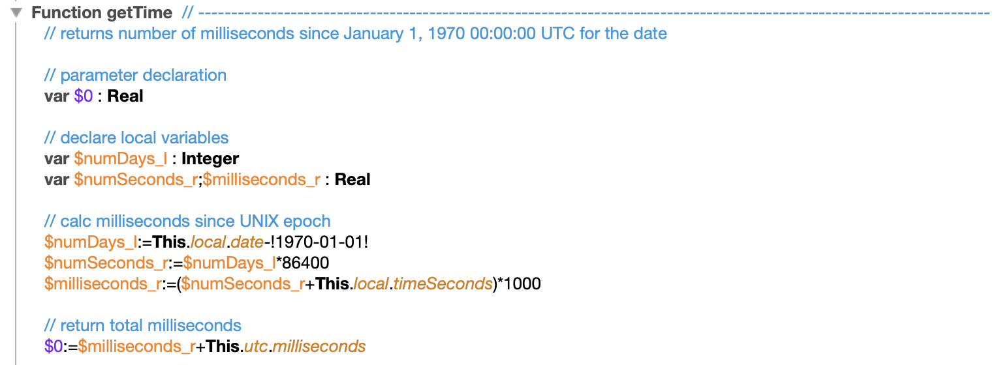

<!-- Class4D information -->

## *Date4D* Class

This is a example of how to create and use classes using 4D v18 R3 that is based on the JavaScript Date object class.

**Created by**: Tim Nevels, Innovative Solutions ©2020 7/12/2020

## Conventions

This documementation uses the following conventions. 

- Class names are in *italic*
- Class methods are in ***bold italic***
- 4D commands are in **bold**

## Background

I decided to try implementing the JavaScript Date class in 4D just to see if I could do it and how close to the same implementation and API I could do. I used this as a learning tool. 
	
First issue is “Date” is a reserved word in 4D, so the class name can't be *Date* like in JavaScript. I chose *Date4D* for the class name. I considered doing an exact as possible implementation of the JavaScript Date object, but I decided against it for a few reasons.
	
First, JavaScript stores  dates as a big integer value using UNIX epoch with a starting date of January 1, 1970 00:00:00 UTC. So dates before this are stored as negative values. 4D has good support for UTC formatted date/time values including milliseconds. I used that for this implementation. No need to deal with negative UNIX time values for dates before 1970, like the lunar landing that occured on July 20, 1969 at 20:17 UTC, or many birth dates. The raw date object data is alway easly readable by humans. 
	
4D uses the operating system UTC date/time libraries so it knows about current and past Daylight Savings Time, leap years, leap seconds all all that complexity. That's mainly why I chose UTC format for storing date values instead of UNIX Epoch seconds. You have to handle all that yourself with UNIX time calculations.
	
4D also knows how to handle a DTS without a “Z” for local time and with a “Z” for UTC time when converting the DTS to a 4D date and 4D time variable. It always converts it to local date and local time. Much of the logic works with local dates and times to perform operations to take advantage of the 4D date and time variable manipulation features. *Date4D* objects always store UTC values. 
	
But there may be some that have a large JavaScript history and they would prefer as much JavaScript compatibility as possible. So I have included a compatibility setting that can be turned on to make some *Date4D* objects methods return the expected values. 
	
Call method ***setJSCompatibility***(**True**) to turn this compatibility setting on or off. It sets a static property in the *Date4D* class that is accessed by these methods to to change how they function to be like JavaScript date objects. Look at this method to see how it is implemented. It follows the recommendations from 4D on how to provide static properties to a class. Call method ***getJSCompatibility*** to get the current setting.
	
JavaScript likes to do things zero based, so starts month numbers at 0 instead of 1. So March is month 2 and not 3 like we are used to in 4D. The default functioning is to not implement zero based ranges and to have it work like native 4D date variables. 
	
***setJSCompatibility***(**True**) setting will use zero based ranges and effects the following methods:

- ***getMonth***
- ***getDay***
- ***setMonth***

***setJSCompatibility***(**True**) setting will also change the value returned by method "getYear". In JavaScript it always returns a 2 digit year instead of a 4 digit year. ***setJSCompatibility***(**False**) — which is the default setting — will return 4 digit years. 
	
A new Date created in JavaScript with no settings is set to the current date and time. This implementation does the same but it uses the **Timestamp** command because it provide milliseconds from the system clock. So `cs.Date4D.new()` will return a *Date4D* object with milliseconds provided by the system. 
	
I am using the **Add to date** command for settting dates, so the results are not always exactly like what you get from JavaScript, but they are exactly like what you would expect from 4D when adding months and days to a date. JavaScript method ***setMonth***( ) is an example of this. No compatibility setting is available to make *Date4D* work like JavaScript in this case. 
	
Methods with “UTC” in the name are designed to work on UTC values directly. Since Date4D objects are already stored in UTC format many of the methods just call their non-UTC method conterpart. In some cases — like ***getUTCDate***() — this is not done because it is easier to just extract the saved day of the month from the stored UTC value. ***getDate***() does a conversion to local time and that can cause the day of the month to change in some circumstances. 
	
**JavaScript Date class methods not implemented**

- new Class constructor option of "dateString" ("January 31 1980 12:30:15.666")
- new Class constructor option of "numericTimestamp" (12345678987)
- new Class constructor option of "dateString" ("January 31 1980 12:30:15.666")
- new Class constructor option of "numericTimestamp" (12345678987)
- ***parse***( )
- ***setTime***( )
- ***toGMTString***( )                 deprecated
- ***toLocaleDateString***( )     complicated to do correctly localized
- ***toLocaleString***( )             complicated to do correctly localized
- ***toLocaleTimeString***( )     complicated to do correctly localized
- ***toSource***( )                        obsolete
- ***toString***( )
- ***toTimeString***( )
- ***toUTCString***( )
- ***valueOf***( )

## Documentation Source

I used the Mozilla MDN Web Docs documentation for the JavaScript *Date* API when creating this class. *Date4D* follows this documented API except where noted. 

https://developer.mozilla.org/en-US/docs/Web/JavaScript/Reference/Global_Objects/Date

## Example 4D Code

```4d
var $theDate_o : cs.Date4D

$theDate_o:=cs.Date4D.new()

$theDate_o:=cs.Date4D.new(2020;7;12;8;42;38;666)

$utcDTS_t:=$theDate_o.utc.DTS

$theDate_o:=cs.Date4D.new("1969-07-20T20:17:00Z")

cs.Date4D.new().setJSCompatibility(True)
$theDate_o:=cs.Date4D.new(2020;1;1)
$theDate_o.setMonth(12)  // should be 2021-01-01
	
$theDate2_o:=cs.Date4D.new().UTC()
	
cs.Date4D.new().setJSCompatibility(True)
	
$value_b:=cs.Date4D.new().getJSCompatibility(True)
	
cs.Date4D.new().setJSCompatibility(False)  // turn it off
	
$dayNumber_l:=$theDate_o.getDay()
	
$millseconds_r:=cs.Date4D.new().now()

```


## Imbedded Images




| Title   |      |
| ------- | ---- |
| dklskds |      |

